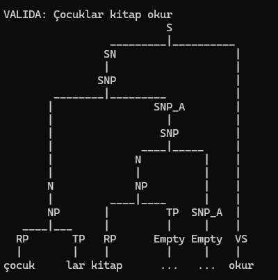

# Gramatica del Idioma Turco
Evidencia: Generacion y Limpieza de Gramatica

## Contexto
El turco es un idioma de la familia turca hablado por más de 80 millones de personas. PEro a diferencia del español o del ingles, en turco la mayoría de la informacion gramatical se construye agregando sufijos a la raiz de la palabra (OptiLingo, 2026). Y una de sus caracteristicas mas particulares es la armonia vocalica, una regla que obliga a que las vocales del sufijo coincidan con la ultima vocal de la raiz

Para esta evidencia escogi un subconjunto del turco enfocado en la formacion del plural y la estructura basica de  una oracion Sujeto-Objeto-Verbo (SOV), que es el orden natural del idioma

### Reglas del plural en turco
El turco tiene un unico sufijo de plural, y este cambia segun la armonia vocalica menor (Turkish Language Learning, 2025):

1. Sufijo `-lar`: se agrega cuando la ultima vocal de la raiz es posterior (a, ı, o, u). Por ejemplo: `kitap` (libro) -> `kitaplar` (libros)

2. Sufijo `-ler`: se agrega cuando la ultima vocal de la raiz es **frontal** (e, i, ö, ü). Ejemplo: `ev` (casa) -> `evler` (casas)

### Vocabulario
Sustantivos con vocal post (utilizan `-lar`):
* `kitap`: libro
* `kapı`: puerta
* `çocuk`: niño
* `araba`: coche
* `kadın`: mujer

Sustantivos con vocal inicial (toman `-ler`):
* `ev`: casa
* `kedi`: gato
* `göz`: ojo
* `gün`: día
* `öğretmen`: profesor

Verbos:
* `okur`: lee
* `görür`: ve
* `sever`: ama
* `alır`: toma
* `yapar`: hace

Conjunciones:
* `ve`: y
* `veya`: o

## Modelos

### Gramatica inicial (Con recursividad a la izquierda y ambiguedad)
```
S    -> SN VS SN | SN VS
SN   -> SN Conj SN | N
N    -> NP | NF
NP   -> RP TP
NF   -> RF TF
RP   -> 'kitap' | 'kapı' | 'çocuk' | 'araba' | 'kadın'
RF   -> 'ev' | 'kedi' | 'göz' | 'gün' | 'öğretmen'
TP   -> 'lar' | Empty
TF   -> 'ler' | Empty
Empty ->
VS   -> 'okur' | 'görür' | 'sever' | 'alır' | 'yapar'
Conj -> 've' | 'veya'
```
Para esto:
`S`: oracion: Esta puede ser sujeto + verbo + objeto o solo sujeto + verbo

`SN`: sintagma nominal. Puede ser un nombre o varios, con una conjuncion

`N`: nombre, separado en dos categorias

`NP` / `NF`: nombre con vocal, ya sea posterior o frontal

`RP` / `RF`: raiz posterior o frontal

`TP` / `TF`: terminacion del plural  (`lar`) o del frontal (`ler`), en caso de que sea singular, de queda vacia

La separación entre raiz y terminacion es lo que nos permitira validar que el sufijo plural usado sea  correcto para esa raiz

### Eliminación de ambigüedad

#### El problema de la ambigüedad
La regla original `SN -> SN Conj SN | N` es ambigua porque una oración con dos conjunciones puede analizarse de múltiples formas.

**Ejemplo:** `çocuklar ve kadınlar ve kediler` (niños y mujeres y gatos)

Puede agruparse como:
1. `(çocuklar ve kadınlar) ve kediler` — primero los niños y mujeres juntos, luego con gatos
2. `çocuklar ve (kadınlar ve kediler)` — primero los niños, luego mujeres y gatos juntos

Esto genera dos arboles de analisis diferentes para la misma oracion, violando el principio de que una gramática debe asignar un solo arbol a cada cadena valida

#### Solucion: Introducir no-terminal intermedio
Se resuelve introduciendo un intermedio `SNP` (Sintagma Nominal Primario):

```
SN  -> SN Conj SNP | SNP
SNP -> N
```

Ahora la recursividad es:
- `SN` solo se combina con `SNP`
- Esto obliga una asociación a la izquierda: `(çocuklar ve kadınlar) ve kediler`
- Se elimina lo que causaba varios arboles

### Eliminacion de recursividad izquierda

#### Por que se vuelve un problema?
La gramaica ambigua tiene recursividad a la izquierda en estas reglas:
- `SN -> SN Conj SNP | SNP`  
- `SNP -> SNP | N`

La recursividad izquierda obliga a que el primer simbolo del lado derecho sea el mismo  del lado izquierdo. Esto causa que parsers  como (LL(1)) entren en un loop: al intentar expandir `SN`, vuelven a necesitar `SN`, sin consumir tokens de entrada.

#### Proceso de eliminación paso a paso

La transformacion estandar para eliminar recursividad izquierda es:
- Si tenemos: `A -> A α | β`  
- La reescribimos como: `A -> β A'` y `A' -> α A' | ε`

Aplicamos esto a cada regla:

**Paso 1: Regla `SN -> SN Conj SNP | SNP`**
- Identificamos: `A = SN`, `α = Conj SNP`, `β = SNP`
- Transformamos a:
  - `SN -> SNP SN_A` (β A')
  - `SN_A -> Conj SNP SN_A | Empty` (α A' | ε)

**Paso 2: Regla `SNP -> SNP | N`**
- Identificamos: `A = SNP`, `α = (vacío)`, `β = N`
- Transformamos a:
  - `SNP -> N SNP_A` (β A')
  - `SNP_A -> SNP | Empty` (α A' | ε)

**Resultado final de la transformación:**
```
SN    -> SNP SN_A
SN_A  -> Conj SNP SN_A | Empty
SNP   -> N SNP_A
SNP_A -> SNP | Empty
```

#### Porque funciona
- Las nuevas reglas generan las mismas cadenas, pero sin recursividad izquierda
- Un parser descendente ahora puede procesar la entrada de izquierda a derecha sin entrar en bucles

### Gramatica final
```
S     -> SN VS SN / SN VS
SN    -> SNP SN_A
SN_A  -> Conj SNP SN_A / Empty
SNP   -> N SNP_A
SNP_A -> SNP / Empty
N     -> NP / NF
NP    -> RP TP
NF    -> RF TF
RP    -> 'kitap' / 'kapı' / 'çocuk' / 'araba' / 'kadın'
RF    -> 'ev' / 'kedi' / 'göz' / 'gün' / 'öğretmen'
TP    -> 'lar' / Empty
TF    -> 'ler' / Empty
Empty ->
VS    -> 'okur' / 'görür' / 'sever' / 'alır' / 'yapar'
Conj  -> 've' / 'veya'
```

## Implementacion
Lo implemente en Python usando la librería NLTK con CFG, para definir la gramatica y ChartParser para poder procesar y analizar las oraciones. Como la gramatica separa la raiz de el final, Entonces utilizamos la funcion para separar, la funcion es: separate que divide cada palabra en raiz y su sufijo (tipo:  `çocuklar` → `çocuk lar`) esto es lo que nos ayuda a validar que el sufijo usado sea el correcto: si alguien escribe `kitapler`, la funcion tratara de separarlo pero si no encuentra una regla que lo acepte `kitap ler` (porque `kitap` es raiz posterior y solo se puede combinar con `lar`) la oracion se rechaza


## Pruebas

### Oraciones aceptadas
1. `Çocuklar kitap okur`  Los niños leen libros
2. `Kediler ev görür`  Los gatos ven la casa
3. `Kadınlar araba sever`  Las mujeres aman el coche
4. `Öğretmenler kitaplar okur`  Los profesores leen libros
5. `Çocuklar ve kadınlar kitap okur`  Los niños y las mujeres leen libros
6. `Çocuklar kapılar veya arabalar görür`  Los niños ven puertas o coches
7. `Kediler ve çocuklar ev sever`  Los gatos y los niños aman la casa

### Oraciones rechazadas
1. `Çocukler kitap okur` Plural incorrecto: `çocuk` necesita `-lar` no `-ler`
2. `Evlar kedi görür` Plural incorrecto: `ev` necesita `-ler` no `-lar`
3. `Kitapler okur` Plural incorrecto
4. `Çocuklar ve okur` sin segundo sustantivo
5. `Kediler kapılar arabalar` sin verbo

### Demostracion con analisis LL1
La gramatica final cumple las condiciones porque ya no es ambigua y no tiene recursividad a la izquierda, para una oracion como `Çocuklar kitap okur` el parser deriva de izquierda a derecha



```
S → SN VS SN
  → SNP SN_A VS SN
  → N SNP_A SN_A VS SN
  → NP SNP_A SN_A VS SN
  → RP TP SNP_A SN_A VS SN
  → çocuk TP SNP_A SN_A VS SN
  → çocuk lar SNP_A SN_A VS SN
  → çocuk lar Empty SN_A VS SN
  → çocuk lar Empty VS SN     
  → çocuk lar okur SN
  → ... → çocuk lar okur kitap
```
### Ejemplo de arbol generado
Salida del programa para `Çocuklar kitap okur`:

                          S             
                 _________|__________    
                SN                   |  
                |                    |   
               SNP                   |  
        ________|_________           |   
       |                SNP_A        |  
       |                  |          |   
       |                 SNP         |  
       |              ____|_____     |   
       |             N          |    |  
       |             |          |    |   
       N             NP         |    |  
       |         ____|____      |    |   
       NP       |         TP  SNP_A  |  
   ____|___     |         |     |    |   
  RP       TP   RP      Empty Empty  VS 
  |        |    |         |     |    |   
çocuk     lar kitap      ...   ...  okur

### Clasificación según la jerarquía de Chomsky

#### Antes de la limpieza
**Clasificación: Tipo 2 (Context-Free Grammar)**

Analisis:
- Cada regla tiene exactamente un no-terminal en el lado izquierdo 
- El lado derecho contiene mezcla de terminales y no-terminales 
- No es Tipo 3 porque varias reglas tienen múltiples no-terminales en el lado derecho:
  - `S -> SN VS SN` (3 símbolos, 2 no-terminales)
  - `SN -> SN Conj SN` (3 símbolos, 2 no-terminales)
  
Una gramatica regular (Tipo 3) requiere que cada regla tenga como maximo un no-terminal en el lado derecho y que esté en posición fija 

#### Despues de la limpieza
Clasificación: Sigue siendo Tipo 2 (CFG)

Propiedad importante: La eliminación de ambigüedad y recursividad izquierda NO cambia la clase de Chomsky de la gramática

Esto es porque:
- La gramatica limpia genera exactamente las mismas cadenas que la original
- Solo se reorganizan las reglas, no se cambia el lenguaje aceptado
- La transformación es equivalente en poder expresivo

### Analisis de complejidad temporal

#### Gramatica original
Complejidad: Exponencial O(2^n) en el peor caso

Problemas:
- Recursividad infinita: Parsers descendentes entran en bucles al expandir `SN -> SN `
- Multiples arboles: La ambigüedad obliga a explorar todos los posibles agrupamientos
- Ejemplo: Oracion con n conjunciones genera ~2^n arboles distintos
- Parsers generales (CYK, Earley): Incluso con memorizacion, complejidad O(n^3) × factor de ambigüedad

#### Gramatica limpia (LL(1))
Complejidad: Lineal O(n) para parsers LL, O(n^3) para parsers generales

Mejoras:
- Sin recursividad izquierda: Cada simbolo se expande sin volver a expandirlo inmediatamente
- Sin ambigüedad: Un unico arbol de análisis por cadena válida
- Decisiones deterministas: Cada token consume exactamente una acción sin backtracking
- Parsers LL(1): Requieren mirar solo 1 token adelante para decidir qué regla aplicar

#### Implementación (NLTK ChartParser)
Complejidad utilizada: O(n^3)

Aunque la gramática es LL(1), NLTK usa ChartParser (algoritmo de Earley), que es un parser general con complejidad O(n^3) independientemente de si la gramática es LL(1) o no. Sin embargo, el resultado es el mismo: un unico arbol valido o rechazo inmediato

Conclusion: Eliminar ambigüedad y recursividad izquierda es fundamental para que una gramatica sea analizable. Una gramatica LL(1) permite compiladores e interpretes eficientes, mientras que una gramatica ambigua o recursiva izquierda es inutilizable en sistemas reales

## Referencias

Adams, M. D., Hollenbeck, C., & Might, M. (2016). On the complexity and performance of parsing with derivatives. *Proceedings of the 37th ACM SIGPLAN Conference on Programming Language Design and Implementation*, 224–236. https://doi.org/10.1145/2908080.2908128

NLTK. (s.f.). Natural Language Toolkit. https://www.nltk.org/

Turkish Language Learning. (15 de julio, 2025). Ultimate Turkish Grammar Guide. https://turkishlanguagelearning.com/turkish-grammar-rules/

Turkish Textbook. (21 de febrero, 2025). Vowel harmony. https://www.turkishtextbook.com/vowel-harmony/

Optilingo (5 de mayo, 2023) https://www.optilingo.com/blog/turkish/everything-about-the-turkish-language/
